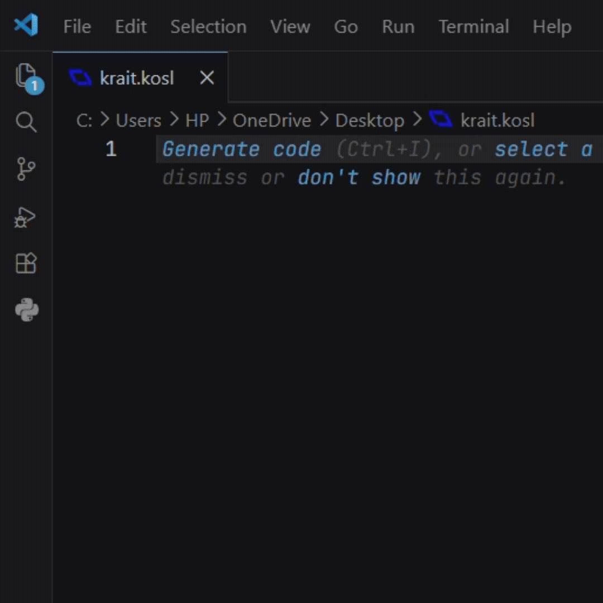

**The official Visual Studio Code extension for the Krait Programming Language.**

  

## Features

* Syntax highlighting
* Auto formatting support
* Validation tooling
* File icons for `.kr`
* Comment support
* Bracket matching
* VS Code snippets
* Theme-compatible scopes

## File Support

Supported files:

* `.kr`

The extension includes:

* custom file icons
* syntax-aware highlighting
* formatter integration

## Docs

To see the Krait Docs, see the [Wiki](https://github.com/KraitDev/krait/wiki)

## Contributing

We welcome contributions. See [CONTRIBUTING.md](CONTRIBUTING.md) for Details

## Security

See [SECURITY.md](SECURITY.md)

## License

This Project is managed by **KraitDev** and is licensed under the terms of the **MIT License**. See [LICENSE](LICENSE)
